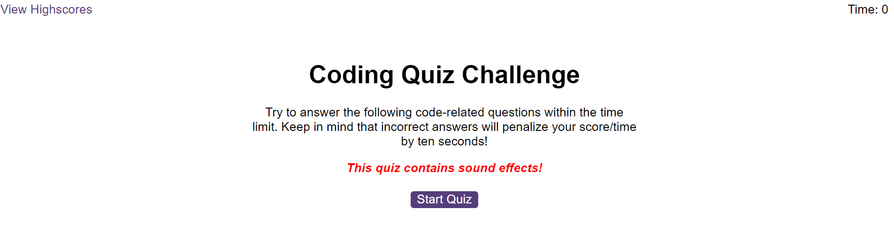
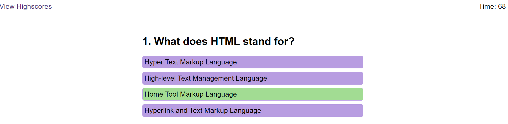
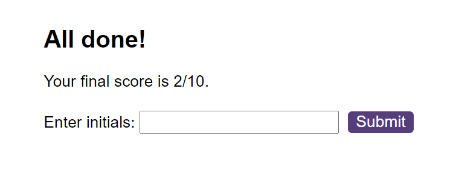
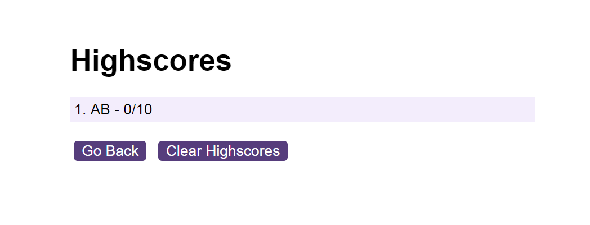

# Code-Quizz

## Features

A coding related quiz of 10 questions to test main front-end topic knowledge. Quiz has a timer which will reduce by 10 seconds during each wrong answer. Once completed it is possible to type the name in the highscore form and save for future reference.

## Example

Front page:

Answer highlight and timer:

Option to save the score:

List of scores:

## Usage

Follow the link below to access the quiz:
https://raam337.github.io/Code-Quizz/index.html